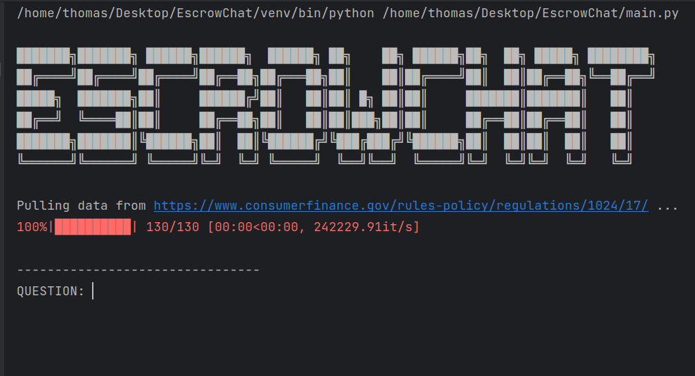

# EscrowChat

## Overview

A prototype chatbot that utilizes a Large Language Model (LLM) to 
respond to user queries based on domain-specific custom knowledge; 
in this case, consumer finance escrow regulations.

## Installation

EscrowChat has so far been tested on recent versions of Ubuntu Linux, and Mac OS.

Run `./install.sh`, which will automatically create a new virtual environment, 
and install the dependencies listed in `requirements.txt`.

```
chmod +x install.sh
./install.sh
```

## Usage

_**EscrowChat requires the user to provide a valid OpenAI API key.**_
This will be cached locally in a `.env` file at the root of the project directory,
if it is not already included in the local system environment variables.

From the root directory of this project, activate the virtual environment,
and then run the script:

```
source venv/bin/activate
python main.py
```

After this, you should see something like this:



at which point you can begin interacting with the chatbot!
